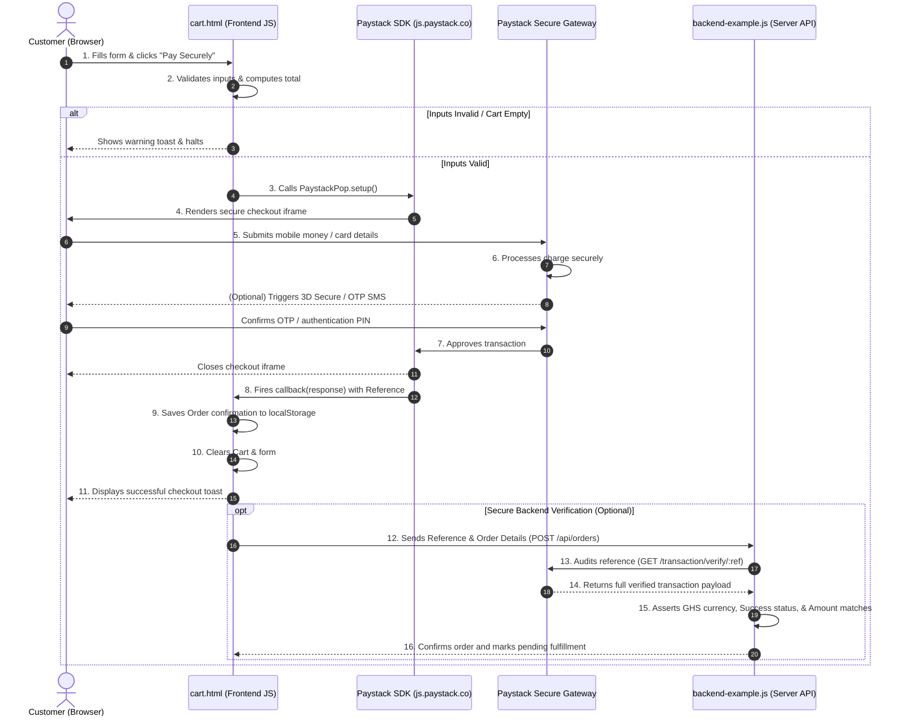

# Paystack Integration Architecture

This document details the system design, communication protocols, and security workflows governing the **Paystack Checkout Integration** on the FITZONE GH website.

---

## 🗺️ Architectural Workflow

The payment flow leverages **Paystack Inline**, which injects a secure banking-grade iframe directly into the customer's browser. This maintains a premium, fast user experience on FITZONE while transferring all payment security compliance (PCI DSS) to Paystack's certified servers.

---

## 🔒 Security Specifications

### 1. Zero-Footprint Credentials Handling
- FITZONE **never** receives, handles, processes, or stores any credit card PAN, CVV, or Mobile Money authorization PINs on its own servers. 
- All sensitive input boxes are drawn dynamically inside an sandboxed iframe hosted by Paystack's PCI DSS Level 1 Certified infrastructure.

### 2. Front-End Validation Guards
- The customer checkout form in `cart.html` is strictly validated using HTML5 validation assertions before any request is sent to Paystack.
- If field parameters (such as `Email Address`, `Phone Number`, `Delivery Address`) are blank or invalid, the gateway launch is blocked immediately, saving API overhead and customer frustration.

### 3. Server-Side Double-Entry Audit (Double-Check)
- While frontend transaction confirmations are immediate, critical business actions (such as dispatching orders or marking accounts as paid) should verify the transaction reference on the backend.
- The `backend-example.js` file illustrates how a backend server double-checks payments:
  - **Amount Check:** Checks that the transaction's reported payload amount (divided by 100) exactly matches the database record's order subtotal.
  - **Currency Assertion:** Confirms the currency matches `GHS` to avoid fraudulent foreign currency arbitrage tricks.
  - **State Assertion:** Ensures the transaction status parameter is explicitly `'success'`.
